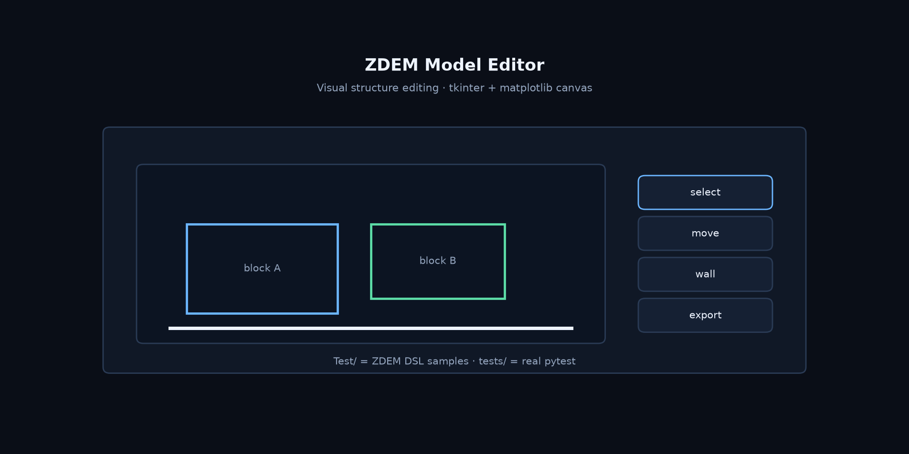

# ZDEM Model Editor

**Visual editor for ZDEM model structure files — tkinter + matplotlib canvas.**

[English](README.md) | [中文](README.zh-CN.md)

[](https://github.com/Phoenix0531-sudo/ZDEM_Model_Editor/actions/workflows/ci.yml)
[](LICENSE)

Edit model geometry/structure with visual feedback instead of pure text. Application code under `zdem_editor/` (core parsers + canvas).  

**Important path split:**

| Path | Meaning |
|------|---------|
| `Test/` | ZDEM **DSL sample scripts** (not pytest) — excluded from ruff |
| `tests/` | Real pytest (e.g. parser smoke) |

## Preview



## Install / run

```bash
git clone https://github.com/Phoenix0531-sudo/ZDEM_Model_Editor.git
cd ZDEM_Model_Editor
pip install -r requirements.txt
python main.py
```

In the app: **File → Open File... (Ctrl+O)** and load a ZDEM DSL script — the samples in `Test/` (e.g. `Test/gen0.py`, `Test/shear0.py`) work out of the box. The canvas renders walls, geometry lines and P4 polygons; the Object List tab groups every entity by type and highlights it on selection. `View → Refresh (F5)` reloads the file from disk.

`Test/` holds real ZDEM DSL sample scripts (not pytest) and is excluded from ruff; the parser suite lives in `tests/` (including integration tests that parse the real `Test/` samples):

```bash
pytest -q tests
```

## License

MIT. See [LICENSE](LICENSE).
